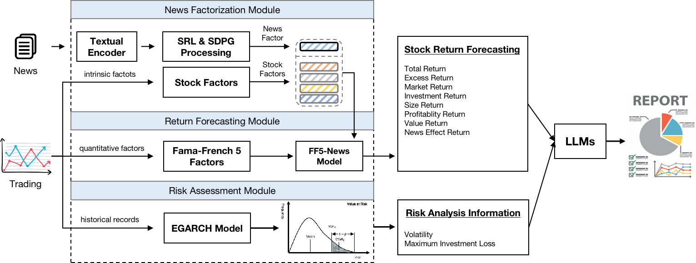
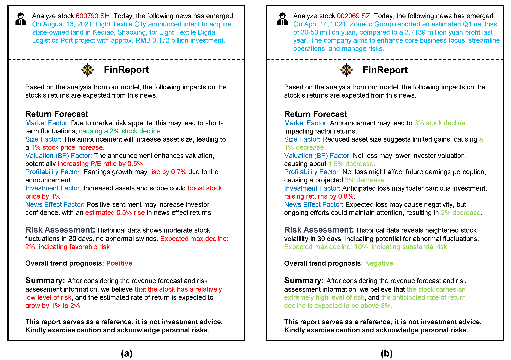

# FinReport: Explainable Stock Earnings Forecasting via News Factor Analyzing Model

PyTorch implementation for [WWW'2024] ["FinReport: Explainable Stock Earnings Forecasting via News Factor Analyzing Model"](https://arxiv.org/abs/2403.02647)

## Example Reports

